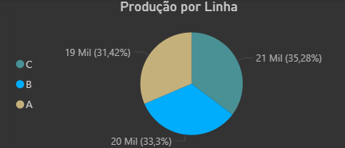

## Estudo de SQL e Powerbi

# Dashboard com PowerBI
**Produção por linha**

**Defeitos por linha**

**Média de defeitos**

# Ferramentas
    MySQL para consultas
    Power BI para modelo
    GitHub para versão e documentação

# O que estou aprendendo
    Importar os arquivos pelo MySQL
    Consultas utilizando SQL
        Baixar e utilizar MySQL connector
        https://dev.mysql.com/downloads/file/?id=546186
    Importar para PowerBI
    Gerar o Dashboard pelo PowerBI
    Gerar Insights a partir do Dashboard

# Principais Insights
    Março teve a maior produção do ano (16.158), porém também teve a maior quantidade de defeitos (177)
    A linha com mais defeitos foi a C, porém foi a que mais produziu (21.498)

# Comandos utilizados em SQL
select shift as linha, AVG(output_units) as media_prod from production group by shift;
select date, downtime_minutes from production order by downtime_minutes desc limit 5;
select p.date, p.output_units, p.machine_utilization, q.defects_count, q.defect_rate from production p join quality q on p.date = q.date;